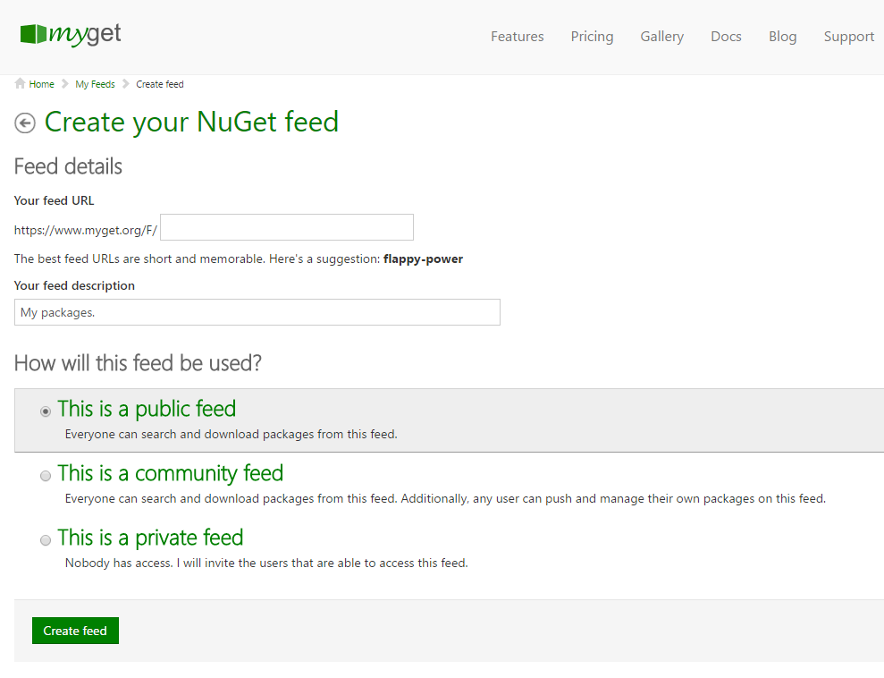
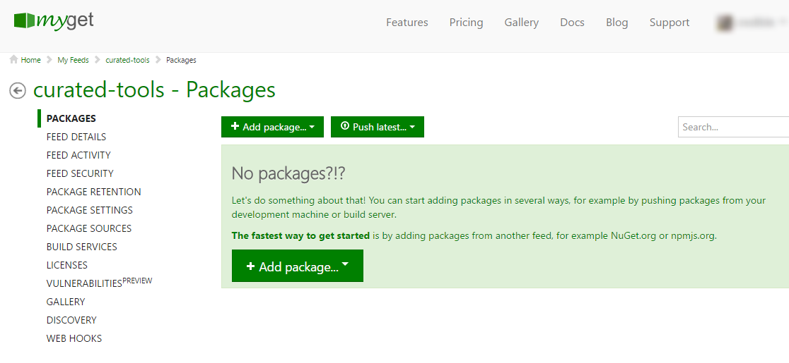

# Creating a MyGet feed \(repository\)

After logging in for the first time, we can create a new feed \(repository\). All we'll need to provide is a feed name, description and its scope.

## Feed name

Naming things can be hard. It might be helpful to know at this stage:

1. The feed name will be used in URL's to work with the feed. Make it something you and team members can remember. Feed are always owned by a user, and in the UI they are prefixed with the feed owner's username.
2. If you change your mind about the feed name, the feed can be deleted and a new feed can be ceated. However, this is not a satisfactory option when there are already many packages on the feed - we'd have to add them all again.
3. While there isn't a _Rename feed_ function, we can accomplish the same thing via the _Clone feed_ feature - even for a feed containing packages. 

## Feed description

The feed description is for your benefit. It is displayed on the Feed Details page. When a feed is published to the gallery, the feed description is also used there to provide a short description of what is on this feed.

## Feed scope

Depending on how the feed will be used, we can pick the scope:

* **Public feed **- A public feed can be discovered and consumed by anyone. Only you \(or people you grant privileges to\) can add packages to it. This type of feed is perfect if you want to share packages with other people without them requiring a MyGet login. Open-source projects or public SDK's can be distributed on a public feed.
* **Community feed** - A community feed can also be discovered and consumed by anyone. Anyone can add their own packages to it. This type of feed is like a public feed, except that other people can contribute to it - a bit like a mini NuGet.org or Maven Central.
* **Private feed **- Only you have access, and those people you specifically invite to consume your private feed. Private feeds are only available to paying subscribers. There are limitations on the number of contributors who can add to a private feed. This feed type is ideally suited to share packages with team members or customers in a secure way.

If you are a MyGet Enterprise user, a fourth feed type is available:

* **Enterprise** feeds - Everyone in your organization gets read access to this feed unless other privileges are given to specific users.

Once we provide these details, we can create the feed by clicking the **Create feed** button. Our feed will be created and we can start adding packages or invite other people to collaborate.

