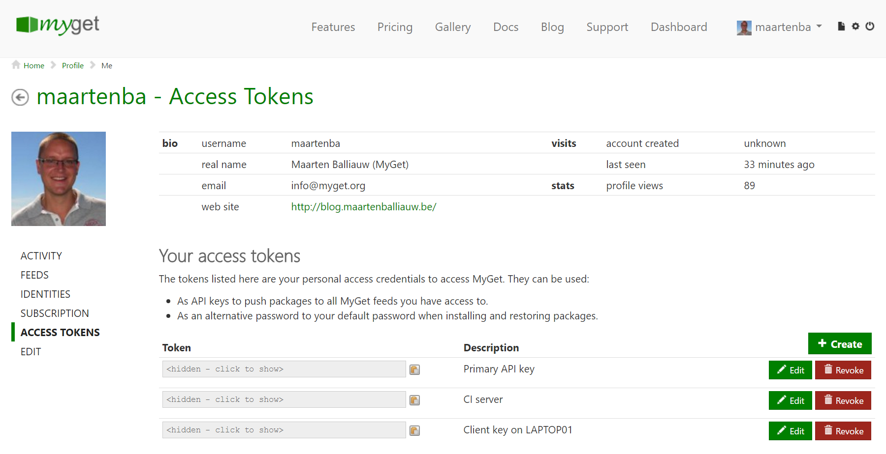
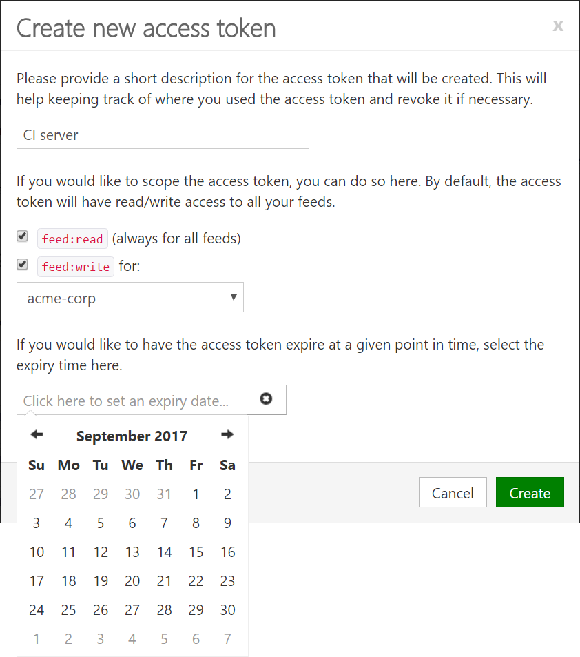

# Managing access tokens

When creating a MyGet account, several credentials are created. A username/password combination, a primary access token (API key) and optionally a linked identity.

The username/password combination can be used to log on to the MyGet web interface, as well consuming packages from package managers such as Visual Studio, `NuGet.exe`, `dotnet`, `paket`, `npm`, `bower`, `mvn`, ... Additionally, every user gets at least one access token, which can be used when publishing packages using package management clients.

Access tokens can be used for all authentication purposes, except logging into the MyGet.org website. They can be used when pushing to your MyGet feed or as an alternate password when authenticating against a private feed.

## Editing access tokens

Additional access tokens can be generated [from our profile page](https://www.myget.org/profile/Me#!/AccessTokens). The primary API key can be regenerated and new tokens can be easily created or revoked.

Every access token has several attributes that can be attached:
 
* A short description: this will help keeping track of where you used the access token and revoke it if necessary.
* A scope: a key can, for example, be scoped to allow access only to a specific feed - limiting the surcace area to which a given access token can push packages.
* An optional expiration date, after which the token will no longer be valid.

    <strong>Note:</strong> When editing access tokens, the <em>value</em> of the access token is always hidden by default to prevent others who may be looking at our screen from seeing the access token. The value can be copied to clipboard using the button right next to it, or visualized by clicking it.

## Scoped access tokens

Many development teams are making use of a continuous integration server like TeamCity, Jenkins or VSTS to build their projects and push generated packages to their MyGet feed. When having multiple feeds, it is a good practice to limit the feeds this access token/API key can push packages to, ensuring the surface area of the specific access token is limited to just the feeds the access token requires access to.

In short, scoped access tokens:

* Are a good security best-practice: use minimum required permissions for a specific operation
* Avoid services/users accidentally pushing packages by using read-only tokens where possible
* Allow pushing packages without the ability to get access to other packages on the feed (write-only)

When creating or editing access tokens, we can select whether we want to create a read-only or write-only access token. Write access can also be limited to just one feed.

