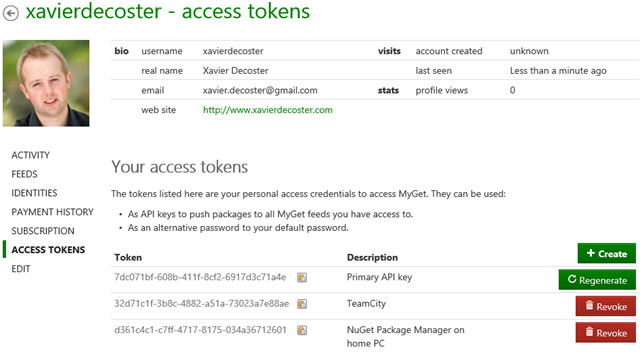

# Managing access tokens

When creating a MyGet account, several credentials are created. A username/password combination, a primary access token (API key) and optionally a linked identity.

The username/password combination can be used to log on to the MyGet web interface, as well consuming packages from package managers such as Visual Studio, `NuGet.exe`, `dotnet`, `paket`, `npm`, `bower`, `mvn`, ... Additionally, every user gets at least one access token, which can be used when publishing packages using package management system clients.

Access tokens can be used for all authentication purposes, except logging into the MyGet.org website. They can be used when pushing to your MyGet feed or as an alternate password when authenticating against a private feed.

## Editing access tokens

Additional access tokens can be generated [from our profile page](https://www.myget.org/profile/Me#!/AccessTokens). The primary API key can be regenerated and new tokens can be easily created or revoked.

Every access token has several attributes that can be attached:
 
* A short description: this will help keeping track of where you used the access token and revoke it if necessary.
* A scope: a key can, for example, be scoped to allow access only to a specific feed - limiting the surcace area to which a given access token can push packages.
* An optional expiration date, after which the token will no longer be valid.

## Scoped access tokens

TODO

