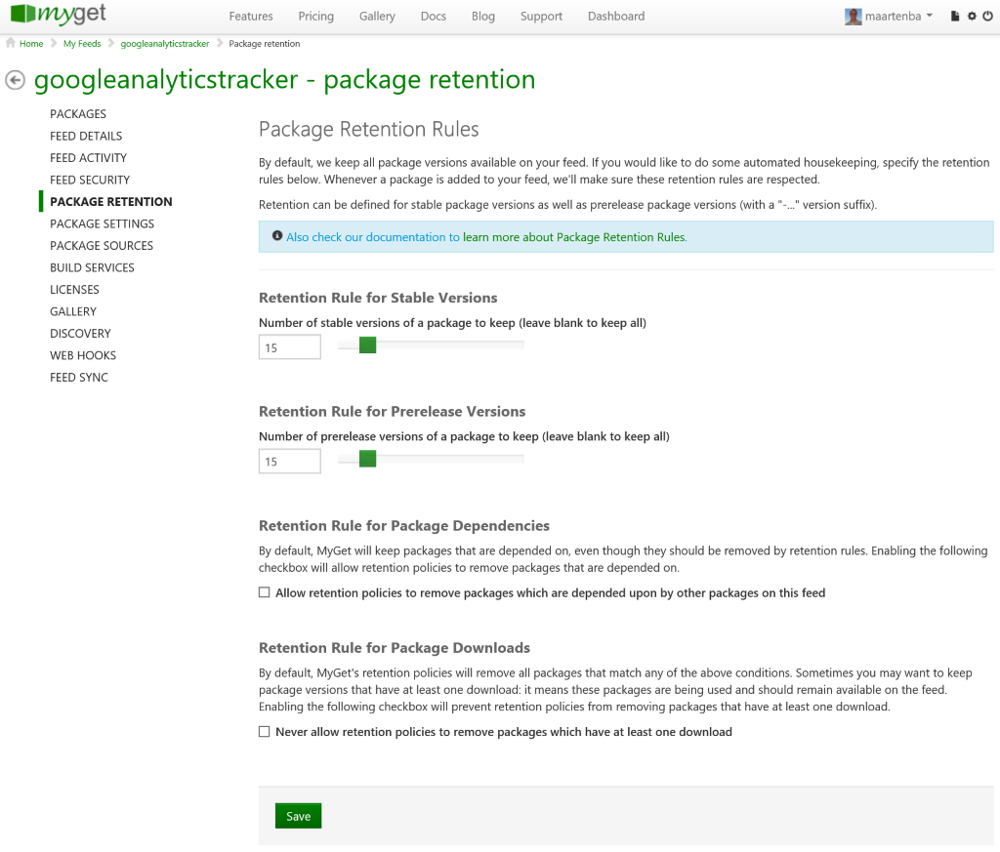
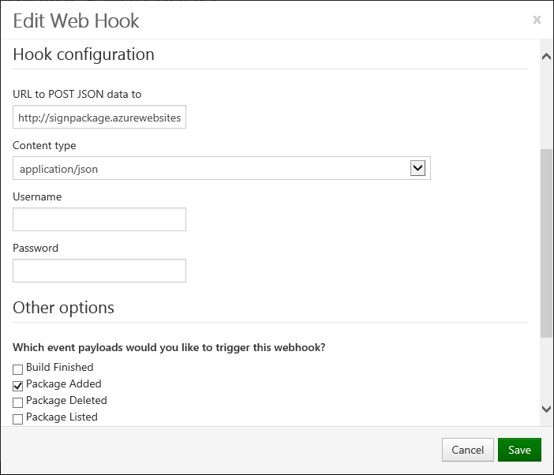

# Package retention

As you produce more and more packages, it may become harder to manage all of those assets.
**By default, we keep all package versions available on your feed.**
Over time though, you may find your feeds to become larger and larger, perhaps even growing beyond the *storage quota* included in your MyGet subscription plan.
That's why we introduced *package retention* functionality early on ([December, 2012](http://blog.myget.org/post/2012/12/18/Package-retention-policies.aspx)).

## "Sticky" packages

Before diving into configuring any package retention policies, you may want to consider which packages you whish to retain.
**Certain packages should never be deleted automatically.**

Defining which packages you whish to retain can easily be done by *pinning* packages, so they stick around, **even when package retention policies apply**.
Package retention rules will ignore any pinned packages, to avoid they accidentally get removed during housekeeping.

From the package details page, you can define which package versions should be retained using the **Pin** button next to the package.
Alternatively, you can pin all versions at once, all but latest, or only the latest version using the convenient dropdown button at the top of the *Package History* list.
Of course, you can also **Unpin** packages using the same approach.


## Defining package retention rules

**By default, we keep all package versions available on your feed.**
Package retention rules allow you to do some automated housekeeping.

These rules are **defined per feed**, so you can define different retention policies for different feeds, however you find them suitable to their purpose.

Retention options currently consist of any combination of the below:

* defining the maximum number of stable versions to keep
* defining the maximum number of prerelease versions to keep
* defining whether to keep depended packages or not
* defining whether to allow removal of packages that have downloads



### Retention Rule for Stable Versions ###

By defining the maximum number of stable versions to keep, the retention policy will keep the configured number of stable versions and remove other stable versions from the feed.

### Retention Rule for Prerelease Versions ###

By defining the maximum number of prerelease versions to keep, the retention policy will keep the configured number of prerelease versions and remove other prerelease versions from the feed.

### Retention Rule for Package Dependencies ###

By default, MyGet will never delete packages that are depended on (within the same feed).

When this retention rule is enabled, we will blindly delete packages that are older than version *X* (as defined in the first two rules), even if there are still packages depending on it. This can put you into trouble and cause [package not found](../How-To/package-not-found-during-package-restore) messages during package restore. For this very reason, the option is **disabled** by default.

### Retention Rule for Package Downloads ###

By default, MyGet's retention policies will remove all packages that match any of the above conditions. Sometimes you may want to keep package versions that have at least one download: it means these packages are being used and should remain available on the feed. Enabling the this retention rule will prevent retention policies from removing packages that have at least one download.

## Custom package retention rules using webhooks

Besides the built-in package retention rules, you can also create your own custom package retention rules by leveraging [MyGet WebHooks](Webhooks).

The following HTTP Post webhooks may be useful for this purpose:

* [Package added](webhooks#Package_added)
* [Package pinned/unpinned](webhooks#Package_pinnedunpinned)
* [Package pushed](webhooks#Package_pushed)

Let's take a look at an example.
Imagine the following scenario: you want to keep the latest 5 versions of a minor version (e.g. keep 1.0.6 through 1.0.2, but delete 1.0.1 and 1.0.0).

### Building the webhook handler

You’ll first need something that can run your custom logic whenever a webhook event is raised.
This can be an ASP.NET MVC, Web API, NancyFx or even a PHP application.
This example uses an ASP.NET Web API controller.
You want to be triggered on POST when a package-added event is raised.



```csharp
// POST /api/retention
public async Task<HttpResponseMessage> Post([FromBody]WebHookEvent payload)
{
	// The logic in this method will do the following:
	// 1) Find all packages with the same identifier as the package that was added to the originating feed
	// 2) Enforce the following policy: only the 5 latest (stable) packages matching the same minor version are retained.
	//    Others should be removed.
	string feedUrl = payload.Payload.FeedUrl;

	// Note: the following modifies NuGet's client so that we authenticate every request using the API key.
	// If credentials (e.g. username/password) are preferred, set the NuGet.HttpClient.DefaultCredentialProvider instead.
	PackageRepositoryFactory.Default.HttpClientFactory = uri =>
	{
		var client = new NuGet.HttpClient(uri);
		client.SendingRequest += (sender, args) =>
		{
			args.Request.Headers.Add("X-NuGet-ApiKey", ConfigurationManager.AppSettings["Retention:NuGetFeedApiKey"]);
		};
		return client;
	};

	// Prepare HttpClient (non-NuGet)
	var httpClient = new HttpClient();
	httpClient.DefaultRequestHeaders.Add("X-NuGet-ApiKey", ConfigurationManager.AppSettings["Retention:NuGetFeedApiKey"]);

	// Fetch packages and group them (note:  only doing this for stable packages, ignoring prerelease)
	var packageRepository = PackageRepositoryFactory.Default.CreateRepository(feedUrl);
	var packages = packageRepository.GetPackages().Where(p => p.Id == payload.Payload.PackageIdentifier).ToList();
	foreach (var packageGroup in packages.Where(p => p.IsReleaseVersion())
		.GroupBy(p => p.Version.Version.Major + "." + p.Version.Version.Minor))
	{
		foreach (var package in packageGroup.OrderByDescending(p => p.Version).Skip(5))
		{
		    var url = string.Format("{0}api/v2/package/{1}/{2}?hardDelete=true", feedUrl, package.Id, package.Version);
			await httpClient.DeleteAsync(url);
		}
	}

	return new HttpResponseMessage(HttpStatusCode.OK) { ReasonPhrase = "Custom retention policy applied." };
}
```


Once you have this in place and host it somewhere, you can configure the webhook on your MyGet feed.

### Configuring the webhook

On your MyGet feed, you can create a new webhook.
It should send application/json for the package added event to the URL where you deployed the above code.



When this hook now triggers, MyGet will be retaining just the 5 latest minor versions of a package (ignoring prereleases).

That’s it. Using nothing but webhooks, you can run your own retention policies (or other logic) when something happens on your feed.
