# Visual Studio Team Services Integration

MyGet Package Management works great with the continuous integration tools your team already uses. That includes VSTS Build.
As part of a build, you may want to publish NuGet packages, often including [debugger symbols](/package-managers/symbols-and-sources.md), to your MyGet feed. 

In this article, we'll help you get started consuming and publishing packages from and to MyGet as part of your continuous integration flow.
We'll do this using regular `nuget.exe` and `dotnet.exe` commands and existing VSTS build steps.

In addition, MyGet offers deeper VSTS integration to enable the following scenarios.

* Fetch NuGet packages from VSTS drop location and serve them from MyGet
* Add a VSTS Git repository as a Build Source for a MyGet feed
* Register a MyGet Service Hook within Visual Studio Team Services (if you have an existing MyGet Build Source)

*Of course, if all of this is too cumbersome, we invite you to take a look at [MyGet Build Services](/build-services/todo-what-are-build-services.md).
We even support a convention-based build, able to detect the most common flows, automatically creating and hosting the packages you created!*

## Setup VSTS Build + MyGet

    <strong>Note:</strong> This tutorial describes manually pushing NuGet and/or symbols packages from a VSTS build. <b>The easiest way to publish NuGet package artifacts from VSTS to MyGet</b> is to <a href="https://blog.myget.org/post/2014/05/12/Announcing-Visual-Studio-Online-integration.aspx#scenario1">enable VSTS integration and configure Visual Studio Team Services as an upstream package source</a>.

If you don't want to leverage any of the scenarios offered by MyGet's built-in VSTS integration, you can stick to using regular CLI tools, or the VSTS NuGet build tasks.
Below you find guidance on how to use MyGet in combination with VSTS Build, using regular `nuget.exe`.

    <strong>Note:</strong> Contrary to what the VSTS documentation claims on how to use NuGet, <b>we don't need the VSTS CredentialProviderBundle</b>, at all!

### Using nuget.exe CLI

#### Restoring NuGet packages from MyGet using nuget.exe CLI

When using a third-party NuGet package source such as MyGet, 
you have to create a `NuGet.config` file in order to use either `nuget.exe` or `dotnet.exe` CLI tools on VSTS Build.

We have two options:
* check-in a `NuGet.config` file right next to your `.sln` file
* dynamically create the `NuGet.config` file on VSTS in a pre-restore step

The command to create the `NuGet.config` file is the same though:

<pre><code>nuget sources add -name {feed name} 
                  -source {feed URL} 
				  -username {username} 
				  -password {MyGet access token} 
				  -StorePasswordInClearText // only needed when using dotnet.exe</pre></code>

More information on the `nuget sources` can be found in the [NuGet CLI Reference](https://docs.microsoft.com/en-us/nuget/tools/nuget-exe-cli-reference#sources).

    <strong>Note:</strong> if we use <code>dotnet.exe</code> to restore NuGet packages, we have to use <b>plain text credentials</b> due to lack of support for better authentication schemes in `dotnet.exe`.

If we run the command successfully, the resulting `NuGet.config` file will look similar to the below example (we used "MyGetFeed" as the feed name):

<pre><code>&lt;?xml version="1.0" encoding="utf-8"?&gt;
&lt;configuration&gt;
  &lt;packageSources&gt;
    &lt;add key="Microsoft Visual Studio Offline Packages" value="C:\Program Files (x86)\Microsoft SDKs\NuGetPackages\"/&gt;
    &lt;add key="MyGetFeed" value="https://www.myget.org/F/MyGetFeed/api/v3/index.json"/&gt;
  &lt;/packageSources&gt;
  &lt;packageSourceCredentials&gt;
    &lt;MyGetFeed&gt;
        &lt;add key="Username" value="{username}" /&gt;
        &lt;add key="ClearTextPassword" value="{MyGet access token}" /&gt;
    &lt;/MyGetFeed&gt;
  &lt;/packageSourceCredentials&gt;
&lt;/configuration&gt;</pre></code>

#### Pushing NuGet packages to MyGet using nuget.exe CLI

To push NuGet packages to MyGet, you'll need an API key (also referred to as *access token*).
For push, we recommend [creating a write-only access token](/how-to/access-tokens.md#scoped-access-tokens), scoped to the particul feed you want to push.

The command to push packages to your MyGet feed:

<pre><code>nuget push {access token} {path to .nupkg} -source https://www.myget.org/F/{feed name}/api/v2/package</pre></code>

If you are on the **MyGet Enterprise** plan, you'll have to replace `www` with your tenant name. 
Check the feed details page for NuGet push endpoint information, or ask your MyGet Enterprise Administrator when in doubt.

    <strong>Note:</strong> the NuGet protocol has no v3 push API yet. You have to use the `api/v2/package` endpoint instead.

More information on the `nuget push` can be found in the [NuGet CLI Reference](https://docs.microsoft.com/en-us/nuget/tools/nuget-exe-cli-reference#push).

### Using VSTS Build tasks

#### Add a NuGet Service Connection to your MyGet feed(s)

In order to be able to leverage the VSTS NuGet build task, we first need to make a *Service Connection* to MyGet on our VSTS account.
If you are unfamiliar with VSTS Service Endpoints, we recommend you take a look at the [NuGet service endpoint documentation](https://docs.microsoft.com/en-us/vsts/build-release/concepts/library/service-endpoints#sep-nuget) first.

To register our MyGet feed as a new Service Endpoint in VSTS, we need to follow a few steps, as outlined below.

1. Navigate to **Services** in Team Project Settings

   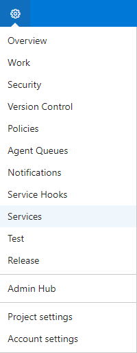

2. Click **New Service Endpoint** and select **NuGet**

   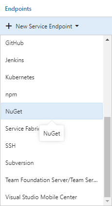

3. Complete the requested information in the dialog that appears: select **Basic Authentication** as authentication method.

   Copy the MyGet feed URL for NuGet v3 from your feed's details page, and provide a suitable *access token*. 
   
   **DO NOT USE YOUR PERSONAL MYGET PASSWORD!**

   Instead, you can use a scoped MyGet access token to be used in the *Password* field.

   For NuGet restore, we recommend [creating a readonly access token](/how-to/access-tokens.md#scoped-access-tokens).
   You can keep the scope global to allow package restores from any feed your MyGet account has access to, or you can reduce it to a particular set of feeds, or just one.
   
   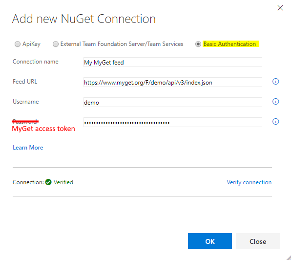

4. Finally, click **Verify connection** before clicking **OK** to complete the wizard.
   
We now have a verified NuGet Service Connection in our VSTS Team Project.

#### Restoring NuGet packages from MyGet using NuGet build task

Once we have the NuGet Service Connection to our MyGet feed(s), we can start configuring the NuGet build tasks on VSTS.

1. Add the **NuGet** task to your VSTS Build Definition before the build step that compiles your code.
   The one before is going to restore NuGet packages from MyGet, the one after will push your created packages to MyGet.

   

2. Configure the *restore* step.

   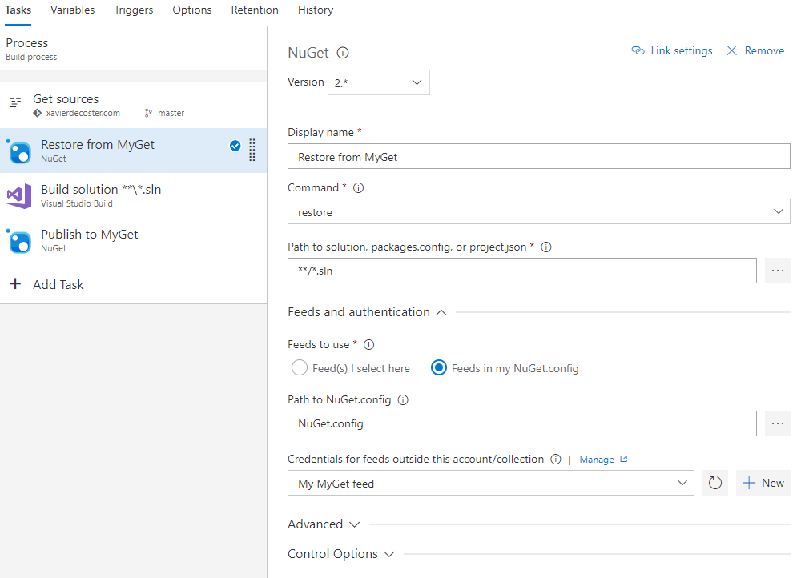

   Even though VSTS now *knows* the NuGet feed endpoint and the credentials to be used, 
   we cannot select this new NuGet Service Connection from the *"Feed(s) I select here"* dropdown in the NuGet build task.
   We don't control this user experience, and there's nothing else we can do but to create the required `NuGet.config` file first...
   
   It is most likely, however, that you already have this `NuGet.config` file in your source repository. 
   If you do, great! Simply select it in the **Path to NuGet.config** field.
   
   If you don't have a `NuGet.config` file yet, you'll need to create one and add it to your source repository (preferably right next to your `.sln` file).
   Unfortunately, `nuget.exe` does not have a `nuget.exe config create` command. 
   We can dive into the NuGet CLI docs, or we can copy the below sample `NuGet.config` file and modify as needed.

	<pre><code>&lt;?xml version="1.0" encoding="utf-8"?&gt;
	&lt;configuration&gt;
		&lt;packageSources&gt;
		&lt;!-- remove any machine-wide sources with &lt;clear/&gt; --&gt;
		&lt;clear /&gt;
		&lt;add key="MyMyGetFeed" value="https://www.myget.org/F/demo/api/v3/index.json" /&gt;
		&lt;!-- optional (remove if not needed): also get packages from the nuget.org --&gt;
		&lt;add key="nuget.org" value="https://www.nuget.org/api/v2/" /&gt;
		&lt;/packageSources&gt;
		&lt;activePackageSource&gt;
		&lt;add key="All" value="(Aggregate source)" /&gt;
		&lt;/activePackageSource&gt;
	&lt;/configuration&gt;</code></pre>

That's it! You can now restore NuGet packages from your MyGet feeds on VSTS Build!
If you also want to publish your packages to MyGet, you can continue reading in the next section.

#### Pushing NuGet packages from to MyGet using NuGet build task

In order to publish packages to a MyGet feed, 
it's convenient to [first configure the MyGet feed as a NuGet Service Connection](#Add_a_NuGet_Service_Connection_to_your_MyGet_feeds) in our VSTS Team Project.

Next, we can configure the NuGet build tasks on VSTS.

1. Add the **NuGet** task to your VSTS Build Definition after the step that compiles your code.
   Preferably even after the build step that runs your unit tests, as you typically don't want to publish packages that failed your tests.

   

2. Configure the *publish* step by selecting the **Push** command, and the target MyGet feed from the **External NuGet Server** dropdown.

   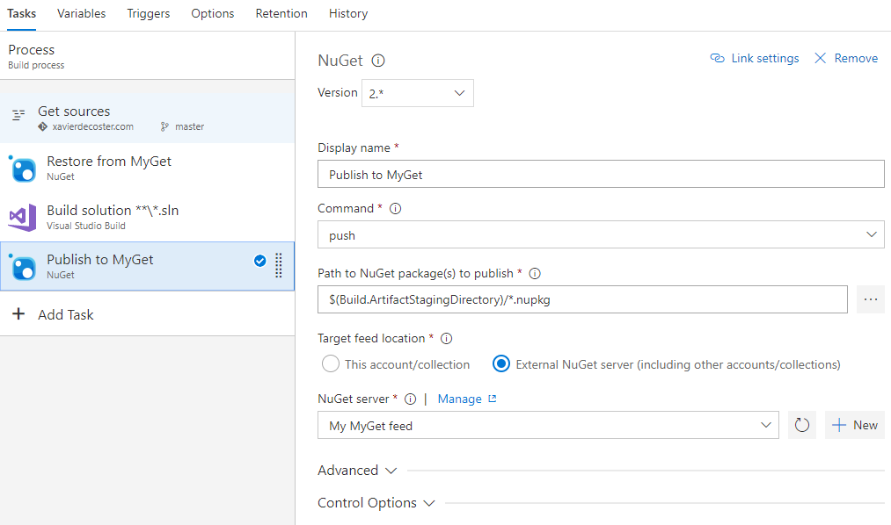

3. Profit!

## Let MyGet pull NuGet packages from your VSTS Build drop location

Having a VSTS Build Definition creating NuGet packages but having trouble consuming those? You can now very easily serve those NuGet packages from a real NuGet feed by having MyGet fetching them directly from your Build Definition’s drop location!

MyGet has the concept of *[Upstream Sources](/how-to/working-with-upstream-package-sources.md)*. Upstream sources could be considered as *upstream package repositories* for your MyGet feed, which is how you can look at the VSTS Build Definition’s drop location. 

To make use of this integration, you need to add a new upstream source to your MyGet feed:

1.	Go to feed settings and select the **Upstream Sources** tab. Select **Visual Studio Team Services build definition** from the **Add upstream source** button.
	

2.	Provide your Visual Studio Team Services **account name** in the dialog that appears and click **Continue**.
	

3.	Select the **Team Project** and **Build Definition** to add as the package source for your feed. Click the **Add** button to complete the configuration of the new package source.
	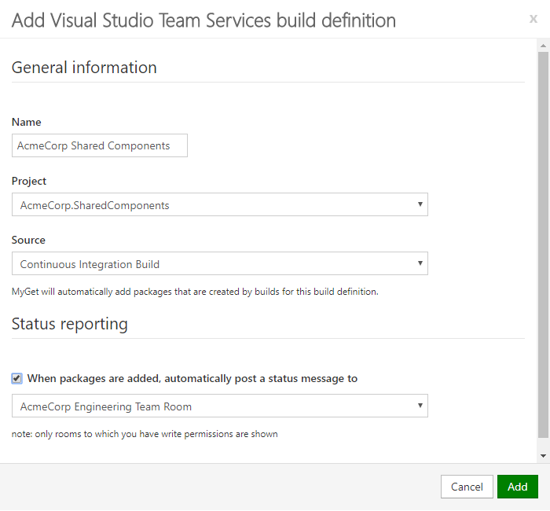

4.	The new VSTS package source has been added to your feed’s package sources, and newly built NuGet packages will be fetched from your Build Definition’s drop location automatically and pushed to the MyGet feed.
	

## Let MyGet Build Services create and host packages from your VSTS git repository

This is the same scenario we already support today for GitHub, BitBucket and Codeplex: you can now register MyGet Build Services as a service hook for your VSTS Git repositories, listening for the *code is pushed* event. 

MyGet feeds have the concept of *[Build Sources](/build-services/todo-build-sources)*. Build sources are a way to express *a link between MyGet Build Services and a source code repository*, whether on GitHub, BitBucket, Codeplex or now also on Visual Studio Team Services. 

The following simplified diagram provides a schematic overview of this new integration scenario.

	<strong>Note:</strong> we currently only support Git repositories (no TFVC support yet).

Follow these steps to enable this scenario:

1.	Go to your MyGet feed settings and select the **Build Services** tab. Select **from Visual Studio Team Services (git only)** from the **Add build source…** button.

	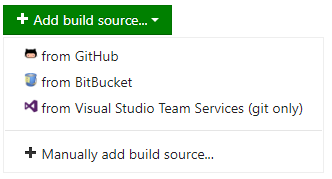

2.	Provide your Visual Studio Team Services **account name** in the dialog that appears and click **Continue**.

	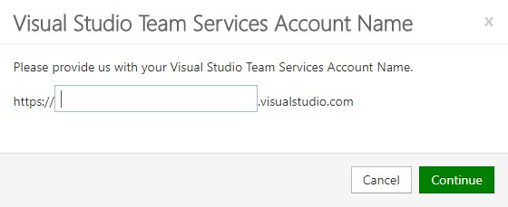

3.	Select the desired build source to **link**. Click the **Add** button to complete the configuration of the new Build Source.

	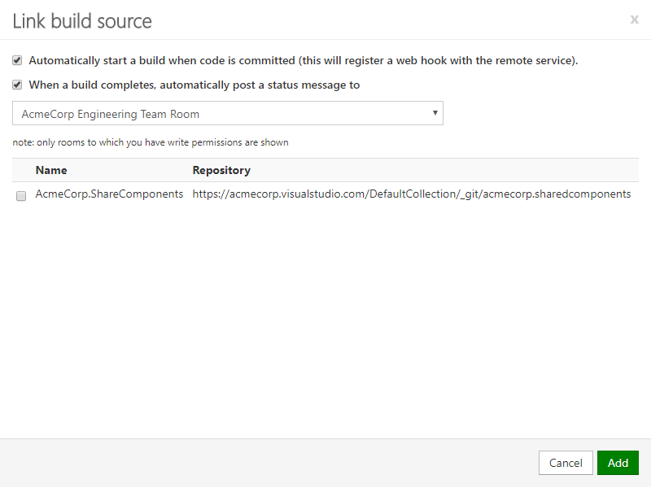

4.	The new VSTS build source has been added to your feed’s build sources, and a service hook has been registered within VSTS. When pushing to your VSTS Git repository, a new MyGet build is going to be triggered and will produce your NuGet packages and push them to your feed.

	

	If you look at your Visual Studio Team Services Administration dashboard and browse your Team Project’s Service Hooks, you’ll see a newly registered web hook listening for the Code is pushed event.
	
	

## Register a MyGet Service Hook within Visual Studio Team Services (if you have an existing MyGet Build Source)

Alternatively, you can also setup MyGet integration from within Visual Studio Team Services. This is particularly useful if you already have an existing MyGet Build Source pointing to your VSTS Git repository and triggered it manually up until now. You should be glad to hear you can now connect these and automate that.

1.	Go to your VSTS Team Project **Administration** dashboard and select the **Service Hooks** tab.

2.	Click the **Add Service Hook** button

	

3.	Within the New Service Hooks Subscription dialog, select the *MyGet* service and click the *Next* button.

	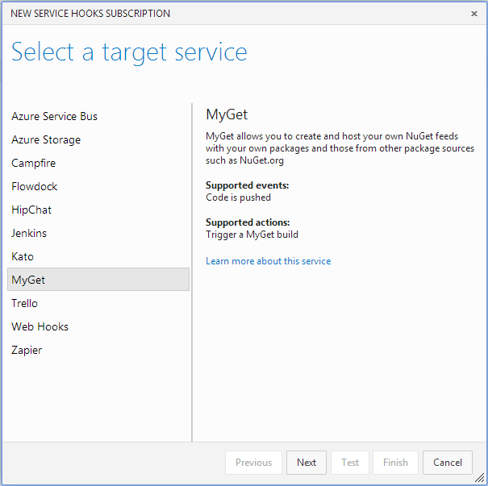

4.	Select the **Code is pushed** event type and the desired **Repository** and **Branch** settings. Click **Next** to continue.

	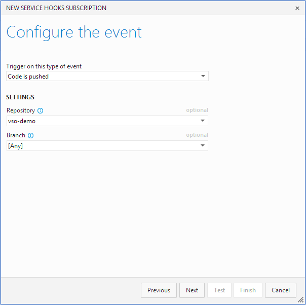

5.	Select the **Trigger a MyGet build** action and provide the target **Feed name** and **Build Source Identifier**.

	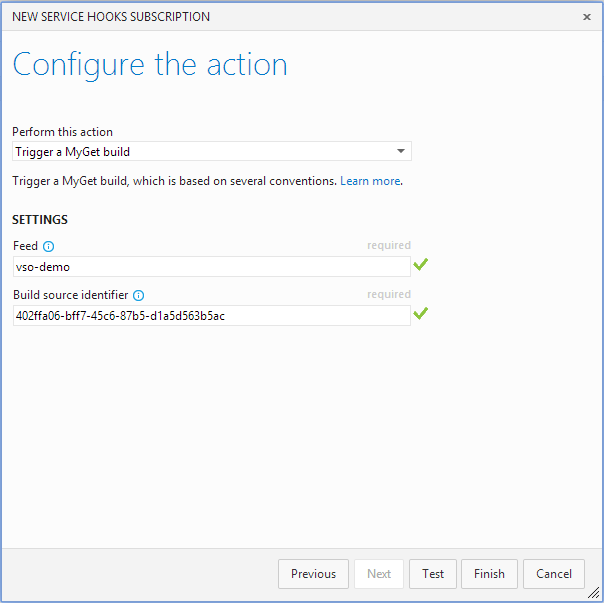

	

		<strong>Note:</strong> You can find the Build Source identifier in your MyGet feed settings > Build Sources, as highlighted below:  
		
	

6.	Click **Test** if you want to test this service hook first, or click **Finish** to complete the wizard. The new service hook is now listed as shown below:

	