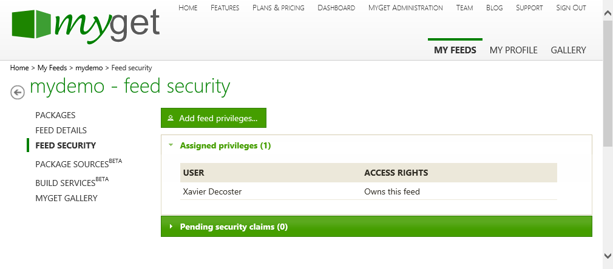
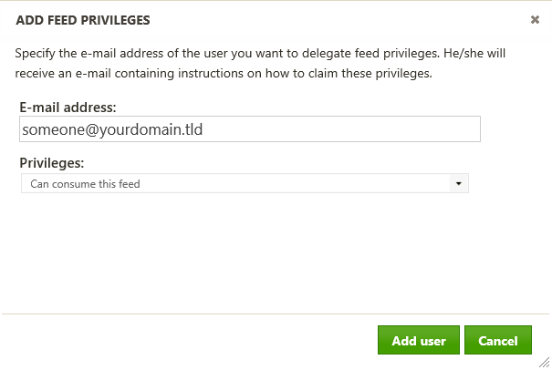

# Inviting users to a feed

After creating a MyGet feed (repository), we can invite other users to it. Depending on the assigned privileges, others can then contribute to development of packages on the feed or simply consume packages.

MyGet features a rich security model around your feeds. As a feed owner, we always have the richest set of permissions possible. We can assign privileges to specific users on MyGet using their email address or username.

## Inviting other users to your feed

In order to give other users a certain privilege on your feed, they have to be invited to your MyGet feed. This can be done in the *Feed security* tab for our feed. This tab lists all users that currently have access to our feed as well as a list of "pending" invitations, that is: users that have been invited to our feed but haven’t confirmed yet.

The *Add feed privileges...* button will open a dialog and allows us to invite a user to your feed by entering his e-mail address. You can immediately assign the correct privilege to this user to ensure the correct privilege will be assigned once the user confirms the invitation.

If the user exists on MyGet, privileges are assigned immediately. If the user has no MyGet account, an invitation e-mail will be sent to the e-mail address provided. When the invitation is accepted, the user will be granted access to our feed with the privileges chosen in the *Add feed privileges* dialog.

## Managing user permissions

After inviting a user to our feed, wecan change the privileges previously assigned. For example, a user who could previously only consume packages may now be granted the privilege of contributing packages to our feed. Also, a user who could previously manage all packages on the feed can be locked down into a privilege where they can only consume packages and no longer manage them.

The *Feed security* tab for our feed lists all users that currently have access to your feed, as well as a list of users that have been invited to our feed but haven't confirmed their privileges yet. The dropdown next to a user's name allows us to modify the currently assigned privilege.

    <strong>Note:</strong> When assigning the <i>&quot;Has no access to this feed&quot;</i> privilege to a certain user, the user will be removed from our feed.

## Available feed privileges

Permissions on a MyGet feed can be granted to other users. The table below lists all possible permissions and their meaning:

<table class="feedprivileges">
	<thead>
        <tr>
            <th>Permission</th>
            <th>Description</th>
            <th>MyGet account required?</th>
        </tr>
    </thead>
    <tbody>
        <tr>
            <td>Has no access to the feed</td>
            <td>The user is denied access to the feed and cannot perform any operations on it.</td>
            <td style="text-align:center;vertical-align: middle">no</td>
        </tr
        <tr>
            <td>Can consume this feed</td>
            <td>The user can search and consume packages but pushing packages is not allowed.</td>
            <td style="text-align:center;vertical-align: middle">no</td>
        </tr>
        <tr>
            <td>Can contribute own packages to this feed</td>
            <td>The user can search, consume and push packages to the feed. Users with this privilege will only be able to manage their own packages. This security setting is identical to the security settings on the official NuGet package source, and the default security setting for a MyGet Community feed.</td>
            <td style="text-align:center;vertical-align: middle">yes</td>
        </tr>
        <tr>
            <td>Can manage all packages for this feed</td>
            <td>The user can search, consume and push packages to the feed as well as use the MyGet website to manage packages.</td>
            <td style="text-align:center;vertical-align: middle">yes</td>
        </tr>
        <tr>
            <td>Can manage users and all packages for this feed</td>
            <td>The user becomes a co-owner of the feed and can search, consume and push packages to the feed as well as use the MyGet web site to manage packages and users. The privilege is essentially the same as being a feed owner except that deleting a feed isn't allowed.</td>
            <td style="text-align:center;vertical-align: middle">yes</td>
        </tr>
        <tr>
            <td>Owns the feed</td>
            <td>The user owns the feed and can perform all operations on it. The user manage feed settings, packages and user privileges. For private feeds, the feed owner must have an active, paid <a href="https://www.myget.org/plans">MyGet subscription</a>.</td>
            <td style="text-align:center;vertical-align: middle">yes</td>
        </tr>
    </tbody>
</table>

## Feed ownership and co-owners

A MyGet feed is always owned by a user account. Other users can be assigned co-owner privileges, allowing them to manage feed settings, packages and user privileges.

Before changing feed ownership, consider the following:

* If the goal is to assign permissions to a user that allow managing feed, packages and users, select the `Can manage users and all packages for this feed` privilege.
* If the goal is to _transfer_ feed ownership, assign the `Owns the feed` privilege. 

Feed ownership can be changed from the feed's *Feed Security* tab.

    <strong>Warning!</strong> For private feeds, the feed owner must have an active, paid <a href="https://www.myget.org/plans">MyGet subscription</a>. If the user does not have an active, paid subscripton, the feed will become locked and can only be unlocked by contacting support. Always be careful when assigning the <code>Owns the feed</code> permission - very often <code>Can manage users and all packages for this feed</code> is intended.

