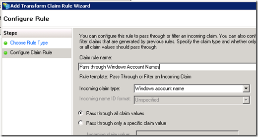

# ADFS integration

The [MyGet Enterprise plan](http://www.myget.org/enterprise) provides support for ADFS to log in, when requested. This document describes the required configuration steps on your ADFS server.

<p class="alert alert-info">
    <strong>Note:</strong> To log in to your feed from Visual Studio, credentials obtained from Active Directory can currently <strong>not</strong> be used as the NuGet client does not support this. Private feeds will still require authentication to happen based on MyGet credentials. ADFS integration will only work for logging in to the MyGet web interface. 
</p>

## Required claims

To work with ADFS, we will require the following claims to be sent to us:

* Name (*http://schemas.xmlsoap.org/ws/2005/05/identity/claims/name*)
* Email address (*http://schemas.xmlsoap.org/ws/2005/05/identity/claims/emailaddress*) 
* Nameidentifier (*http://schemas.xmlsoap.org/ws/2005/05/identity/claims/nameidentifier*) – you can use the AD user name for this claim. As long as it's unique we're happy.

We will, of course, also need either the URL to your *FederationMetadata.xml* document, or a copy of this file to configure the trust relationship on our end.

## Configuring ADFS

If you are uncertain about the steps required to configure ADFS, the following should guide you through it.

1.  Login to your ADFS Server and start the **AD FS 2.0 Management Console**. 
2.	In the tree, right-click on **Relying Party Trusts** under the **Trust Relationships** node and choose **Add Relying Party Trust**. 
3.	A wizard pops up. Skip past the welcome page to **Select Data Source** and enter the URL to MyGet's *FederationMetadata.xml* document: ```https://myget-prod.accesscontrol.windows.net/FederationMetadata/2007-06/FederationMetadata.xml```
4.	Specify a display name and choose your issuance rules policy. For simplicity's sake select **Permit All Users to Access this Relying Party**. Do know you can limit access to MyGet to certain users in your AD by customizing this setting.
5.	On the next page, confirm all the data you've entered and hit finish.

When you're done, leave the **Open the Edit Claim Rules dialog** option checked. We will use this dialog to add some rules to this trust relationship allowing data to flow from Active Directory into MyGet. To get back to this dialog, right click on the **Relying Party Trust for ACS** and click **Edit Claim Rules**.

1.	On the **Issuance Transform Rule**s tab, click **Add Rule**. 
2.	Select **Pass Through or Filter an Incoming Claim** as the template to use and click **Next**.
3.	Now we'll configure a claim (i.e. piece of identity like username, email address etc.) to be passed through to MyGet. Just select the claim from the drop down list, specify a name and click **Finish**. Make sure the **Pass through all claim values** option is selected.

	
 
4.	Repeat the above steps 3 times. MyGet will need the following claims from the dropdown (select a different one in every step):

	* E-mail address
	* Name
	* Windows account name

## FAQ

**When disabling a user account in ADFS, will that also disable that user account's access to MyGet using API keys (access tokens)?**
  
**>** *No. ADFS is a federated identity service, so ADFS integration does not provide MyGet with access to user accounts. MyGet credentials, including username and access tokens, remain on MyGet and therefore are not disabled when disabling the user account in ADFS.*