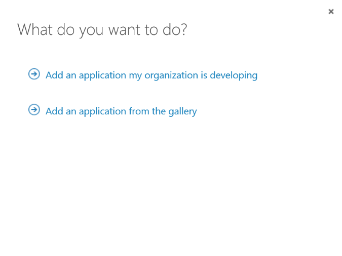
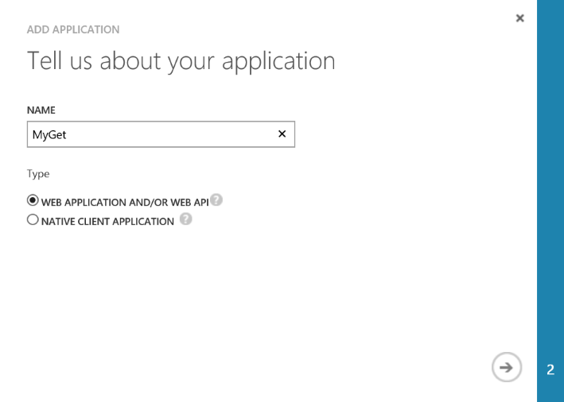
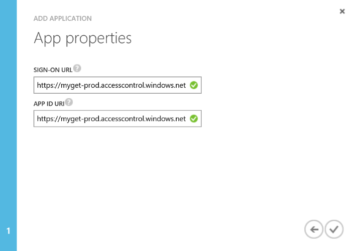
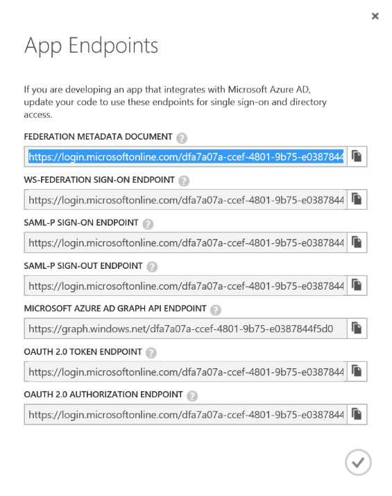

# Azure Active Directory integration

When requested, the [MyGet Enterprise plan](http://www.myget.org/enterprise) provides support for Azure Active Directory to log in. This document describes the required configuration steps on your Azure Active Directory tenant. Note that Azure Active Directory B2C is not currently supported.

<p class="alert alert-info">
    <strong>Note:</strong> To log in to your feed, credentials obtained from Active Directory can currently <strong>not</strong> be used as the various package management clients (such as Visual Studio or, the NuGet client or npm) don't support this. Private feeds will still require authentication to happen based on MyGet credentials. ADFS integration will only work for logging in to the MyGet web interface. 
</p>

## Configuring Azure Active Directory with the MyGet Enterprise plan

To configure Azure Active Directory with the MyGet Enterprise plan, log in to the [Azure Management portal](https://manage.windowsazure.com) and follow the instructions below.

1. **Add a new application**

	From the toolbar, click the **Add** button to add a new application. Select the **Add an application my organization is developing** option and continue.

	<br />

2. **Give the application a name**

	The Azure management portal will ask for a descriptive name for the aplictaion. Enter a name of choice, for example ```MyGet```.

	<br />

3. **Enter the application properties**

	In the application properties, enter the application properties. For both the *Sign-on URL* as well as the *App ID URL*, enter ```https://myget-prod.accesscontrol.windows.net```. This is the URL to our identity provider, which Azure Active Directory will return authenticated users to.

	<br />

4. **Provide us with the Federation Metadata Document URL**

	Once the application is created, click **View Endpoints** from the toolbar and copy the Federation Metadata Document URL. MyGet support will need this URL to finalize the Azure Active Directory integration.

	<br />

Once these steps have been completed, logging in to MyGet using your Azure Active Directory credentials is possible. Note that depending on the settings for the application, you may have to grant access to users in your Azure Active Directory  explicitly.
