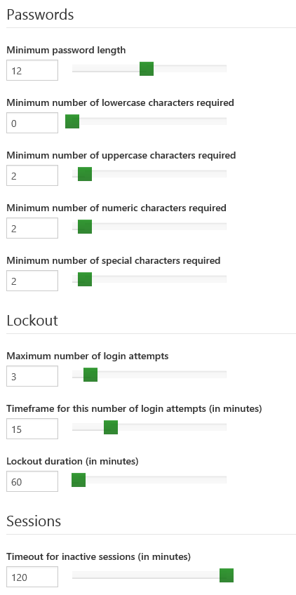
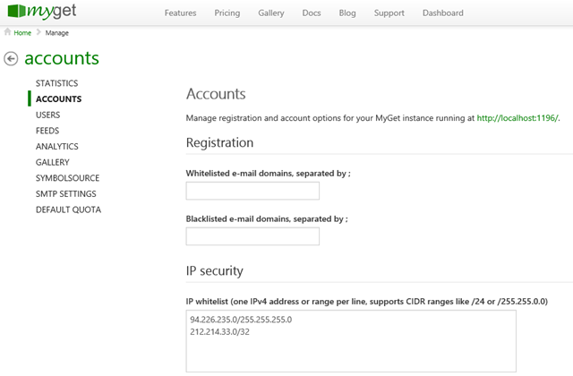
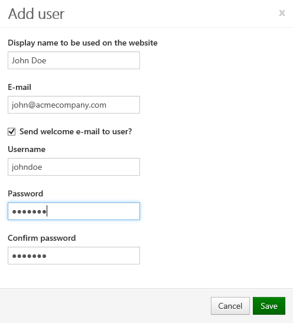

# Management dashboard

[MyGet Enterprise](http://www.myget.org/enterprise) contains everything MyGet has to offer, hosted on a dedicated URL for your team. It comes with an additional management dashboard that can be used to manage everything related to the team such as feeds, users, quota, account policies and so forth.

Let's go over the available options that are available to administrators of the Enterprise account through the management dashboard.

## Statistics

The statistics page provides an overview of common metrics related to the Enterprise account:

* Feed statistics, e.g. number of feeds
* Package statistics, e.g. number of packages hosted
* Storage statistics, e.g. how much storages consumed by the Enterprise account and feeds therein
* Usage statistics, e.g. how many people are working with feeds
* Build staticstics, covering usage of [MyGet Build Services](Build-Services)

## Accounts

The accounts page allows setting account options, such as whitelisted/blacklisted domains, IP security, password policies and so forth.

### Registration

The registration section can be used to whitelist/blacklist e-mail domains. For example, a whitelist can be set to _acmecompany.com_ to only allow users from that domain to register an account.

### IP security

MyGet Enterprise makes it possible to whitelist IP addresses \(or IP ranges\) so only clients can only access MyGet if they are coming from the configured address. The whitelist will be applied for accessing the website, as well as for consuming hosted NuGet feeds.

IP addresses can be entered on separate lines. If an entire subnet has to have access, the IP address can be suffixed with a CIDR suffix \(e.g. /24\) or a subnet mask \(e.g. /255.255.255.0\).

### Registration and Login

The Registration and Login section provides a means of customizing user registration and login.

The text that is shown on the login page \(above username/password\). For example, a notice could be added on who to contact to get an account.

User registration can be disabled so that Enterprise administrators always have to invite users to the MyGet Enterprise plan.

### Passwords

The passwords section enables specifying minimum password length as well as policies such as how many lowercase, uppercase, numeric and special characters should be in a password.

### Lockout

The lockout section provides options to lock a user account after a number of login attempts. For example if 3 login attempts fail over a course of 10 minutes, the account can be locked out for a given duration.

### Sessions

By default, MyGet closes sessions after 2 hours. If it is required to close a session after a shorter time period, it can be specified here. Many teams use this feature to logout users after, for example, 15 minutes of inactivity.

### Feed creation

Creating feeds can be limited to Enterprise administrators/feed creators. When enabled, non-administrative users will see a message that they should contact an Enterprise administrator in order to create a feed.

Individual users can be assigned the _Administrator_ or _Feed creator_ role from the user management dashboard.

## Users

The users section allows for user management. It is possible to create new users, as well as manage roles, manage quota for a user, send a password reset e-mail or delete a user.

### Creating a user

Users can be created by clicking the _Add a new user_ button, after which the display name, user name, password and e-mail can be entered. Optionally, a welcome e-mail can be sent to the user as well.

### Deleting a user

When deleting users, it is possible to transfer the user's feeds to a different user. For example when a user leaves the team or company, their account can be deleted and feeds can be transfered to other users within the MyGet Enterprise account.

### Managing user quota

Default quota can be overriden per user. It is possible to specify:

* Allowed \# of feeds for the user
* Allowed \# of private feeds for the user
* Allowed package size
* Allowed storage per user \(over all feeds owned by the user\)

## Feeds

The feeds page allows for basic feed management. It is possible for an administrator to join a feed team as either the owner or as a co-owner.

## Gallery

It is possible to enable or disable MyGet Gallery. When enabled, users can enlist their feeds in the gallery and make them discoverable for other users and teams. Feeds that are public will also be discoverable to any user outside the team, while feeds that are visible only to users in the Enterprise account will only show up after login.

Optionally, the gallery can also be configured as the default landing page \(instead of the login page\).

## SMTP settings

MyGet comes with a preconfigured SMTP server for sending out system messages to users and administrators. If it is desired to use a custom SMTP server, it can be configured from this page.

## Default quota

Quota for users can be managed individually from the _Users_ page. However, it is possible to configure defaults on the quota page.

Configurable quota are:

* Allowed \# of contributors per feed
* Allowed \# of feeds per user
* Allowed \# of private feeds per user
* Allowed package size
* Allowed storage per user \(over all feeds owned by the user\)
* Allowed storage per feed

