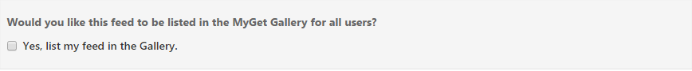
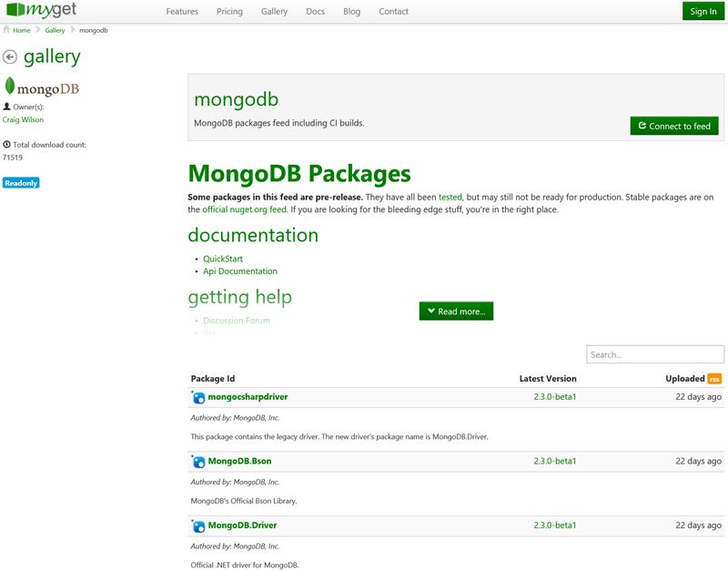
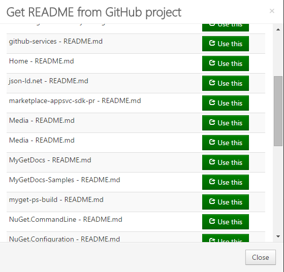
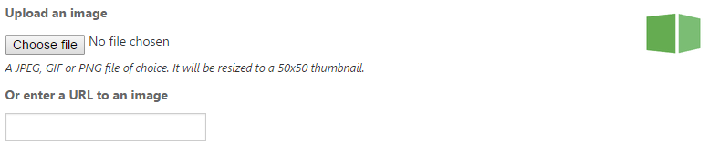

# MyGet Gallery

The [MyGet Gallery](https://www.myget.org/gallery) is the perfect place to promote our feeds and their packages. If we are publishing framework packages to certain package feeds, or releasing nightly builds on a CI feed, we may as well make them discoverable!

On [MyGet.org](https://www.myget.org), feeds can be discovered [in the gallery](https://www.myget.org/gallery) by anyone out there. When working in an [Enterprise plan](https://www.myget.org/enterprise), the gallery can be used to promote feeds to other development teams or customers.

Publishing a feed in the MyGet Gallery allows people to search for it without knowing the exact URL. The gallery details page also lets us provide additional information about the feed or our project, so users can immediately start working with the listed packages.

## Requirements

There is a basic set of requirements that must be met before we can publish your feed in the MyGet gallery.

* Only public and community feeds can be listed in the MyGet Gallery (on the [Enterprise plan](/myget-enterprise/management-dashboard.md) other feed types can be published for subsets of users)
* A feed may not have the default (sample) readme text: it's meaningless and we encourage  providing a meaningful message to feed consumers. Existing README information from a GitHub repository can be imported.
* A feed may not have the default (sample) feed description on the Feed Details page.

## Publishing your feed in the MyGet Gallery

Publishing our feed in the MyGet Gallery is easy - the hard work is in ticking the **Yes, list my feed in the Gallery** checkbox on the feed's Gallery settings page.

 
Click the **Save** button to update your settings.

Note that it may take up to 15 minutes for your feed to appear in the MyGet Gallery due to caching.

## Adding a README using markdown

To provide feed consumers with some context about the feed, such as a short "Getting Started" summary, a disclaimer, or project-related information, we can add a README to our feed. The README can be written in Markdown, and will be displayed on the gallery details page:

An existing README can be imported from GitHub. Click on the **import from GitHub** link and select an entry in the popup dialog that appears. The **Use This** button next to it will start the import.

## Setting a feed icon

We can also add an icon to make our feed easily recognizable in the gallery listing by entering an URL to an image, or by uploading a JPG, GIF or PNG file of choice. Optimal icon resolution is 50 by 50 pixels.

