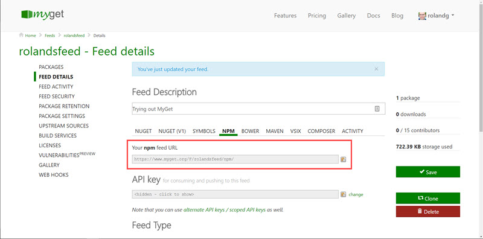
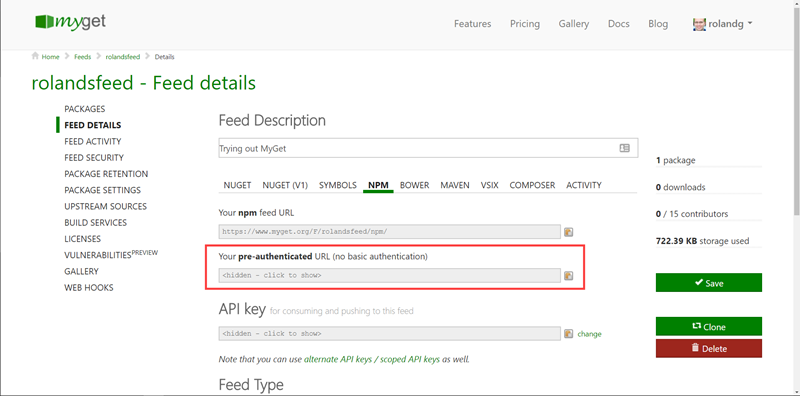

# NPM \(Node.js\)

TODO (inspiration on http://docs.myget.org/docs/walkthrough/getting-started-with-npm *and* http://docs.myget.org/docs/reference/myget-npm-support)

## Connecting to an NPM feed

### Getting the NPM feed url
First things first. Let's investigate where we can get the NPM feed URL. We'll need to keep it somewhere before we start playing around with the tooling.



After selecting our feed from landing page that is displayed after login, click on Feed Details on the left. Then select the NPM tab. 

The npm feed url is right there. Just click on the little icon on the right of the url to copy it to the clipboard.

### Setting up NPM in a folder
When using a fresh folder you have to setup npm for the folder first using the command:

```shell
npm init
```
It will create a package.json file in which all installed packages are recorded. For more detailed information see the [NPM docs](https://docs.npmjs.com/cli/init).

Private feeds require a bit more configuring we'll look at that next.

### Using private feeds
When the feed is a private feed users can be [invited](/inviting-users-to-a-feed.md). We can only connect to a private feed with an invitation. 
Once we have accepted the invitation we'll have to let our local NPM installation know who we are. We have to do this once for each private feed. Type:
```shell
npm adduser --registry [feedUrl]
```
You can also use the login command which is equivalent.
We are then prompted to enter a credentials. These are our MyGet credentials. After this we are ready to connect to the feed!

Easier but less secure is connecting with a pre-authenticated URL.



When the feed is configured as private then the URL is made available in the feed details section.
The advantage is that there is no need to invite or add users. Everyone with the link can access the feed. The disadvantage is that everyone with the link can access the feed. :-)

### Connecting using the NPM CLI
Did you [get the NPM URL](#getting-the-npm-feed-url)? Then we're good to go.

To install a package from the feed, type:

```shell
npm install [packageName] ---registry [feedUrl]
```

I can image that it will become very tedious to supply the feedUrl with every command. If you want to make the feed the default feed, type:

```shell
npm config set registry [feedUrl]
```

## Creating NPM packages

+ very short intro to build services

## Publishing to MyGet

## Scoped packages
