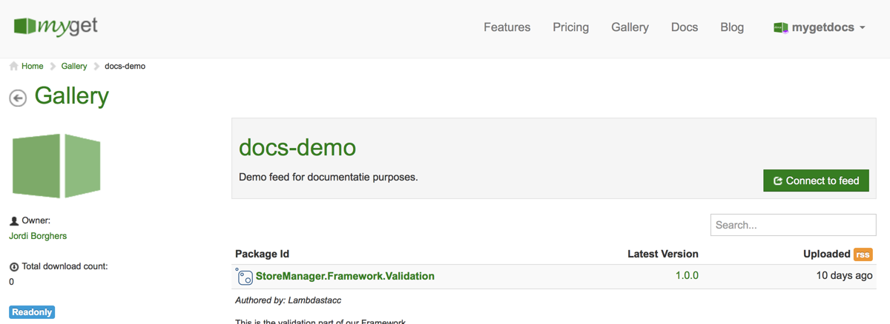
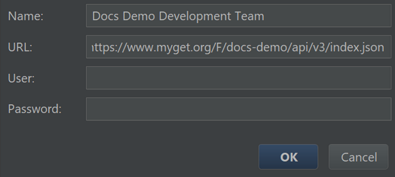

# NuGet \(.NET\)

TODO (inspiration: http://docs.myget.org/docs/walkthrough/getting-started-with-nuget)

## Connecting to a NuGet feed

Here we will discuss were to find the feed URL and how to connect using our favorite NuGet client.

### Find the feed URL

#### Private feed

Private feeds are only accessible to the feed owner and to other users who were granted access by the feed owner. To connect to a feed we don't own, we may have to request permission from the feed owner.

<p class="alert alert-success">
    <strong>Tip:</strong> Find out how to invite users <a href="../inviting-users-to-a-feed.md">here</a>
</p>


<p class="alert alert-success">
    <strong>Tip:</strong> We support <a href="#visualstudio">Visual Studio</a>, <a href="#jetbrainsrider">JetBrains Rider</a>, the <a href="#nugetcli">NuGet CLI</a>, <a href="#dotnetcli">dotnet CLI</a>, <a href="#paket">Paket</a> and any other NuGet clients that use the standard NuGet v2 or v3 protocols.
</p>

#### Public feed

There are two types of public feeds we can connect to: public feeds we own or a feed we want to consume from the gallery. The only real difference, in terms of consuming, is where to find the URL of the feed.

MyGet feeds have multiple endpoints, and each one is specific to a particular package type and protocol. Pick the NuGet endpoint URL that matches the protocol version you want to use (e.g. NuGet v3), and use that to configure the feed endpoint in your favorite NuGet client. Let's go over how to connect to these.

#### Gallery feed

After browsing the list of feeds on the [MyGet Gallery](https://myget.org/gallery) (or on the MyGet Enterprise Gallery), we can get its connection details using the **Connect to feed** button.



This will open a dialog where we can find the various endpoints for this feed.


We will need the NuGet V3 URL, so let's copy it for later use.

### Visual Studio

#### Public feed

To find the feed URL check the [Find our feed URL](#find-our-feed-url) section.

#### Private feed

#### Credential Provider for Visual Studio

inspiration: http://docs.myget.org/docs/reference/credential-provider-for-visual-studio but needs to be nicer

### JetBrains Rider

The first step in connecting Rider to a MyGet feed is adding it as a package source. We can do this using NuGet.exe (via good old [NuGet.config](https://docs.microsoft.com/en-us/nuget/schema/nuget-config-file#package-source-sections), or from within Rider. From the **NuGet tool window** (<kbd>Alt</kbd> + <kbd>7</kbd> will bring this right up), open the **Sources** tab. This will show us all of the NuGet configuration files that are in play, and a list of all feeds configured.


From here, we can add our MyGet feed (or edit an existing entry). We will have to provide our feed a name so we can easily recognize it in Rider, and the URL to our feed.

#### Private feed

Details on how to find the feed URL can be found in the [Find the feed URL](#find-the-feed-url) section.

In order to consume our private feed we have to give the feed URL and enter our credentials.


While Rider supports using pre-authenticated feeds as well as feeds that require entering credentials, we recommend using the latter. Rider safely stores our MyGet username/password in its [password store](https://www.jetbrains.com/help/idea/passwords.html).

When using the pre-authenticated feed we, of cource, don't need to enter our credentials.

#### Public feed

Details on how to find the feed URL can be found in the [Find the feed URL](#find-the-feed-url) section.

The feed types can be found in the **FEED DETAILS** section under **Feed Type**.


After making sure our feed is a public one we can consume it in Rider.



To work with public feeds, we just leave the credentials empty and Rider will connect to the feed.


### NuGet CLI

#### Public feed

Details on how to find the feed URL can be found in the [Find the feed URL](#find-the-feed-url) section.

#### Private feed

Details on how to find the feed URL can be found in the [Find the feed URL](#find-the-feed-url) section.

### dotnet CLI

#### Public feed

Details on how to find the feed URL can be found in the [Find the feed URL](#find-the-feed-url) section.

#### Private feed

Details on how to find the feed URL can be found in the [Find the feed URL](#find-the-feed-url) section.

### Paket

#### Public feed

Details on how to find the feed URL can be found in the [Find the feed URL](#find-the-feed-url) section.

#### Private feed

Details on how to find the feed URL can be found in the [Find the feed URL](#find-the-feed-url) section.

## Creating NuGet/.NET Core packages

could have links to the NuGet documentation

## Publishing to MyGet

## Troubleshooting

### Package not found during package restore

When working with our own feed, whether private or public, chances are we want to consume more than just that feed. When using our MyGet feed and the NuGet.org feed simultaneously, an interesting error may occur during package restore.

> Unable to find version xxxx of package yyyy

The reason this happens is because the NuGet command line, the NuGet Visual Studio Extension and the NuGet Powershell Console all have a configuration option specifying which package source to install from. When this setting is changed to one specific feed, other feeds will be ignored and the error above will be shown during package restore.

The solution is very simple: we can set the active package source to "aggregate" in Visual Studio, or simply configure NuGet to always use the "aggregate source" for the current project. NuGet has an inheritance system for NuGet.config files, where the NuGet.config file closest to the solution file gets the last say. If we add the following NuGet.config file next to the solution file for our project, we should be fine:

```xml
  <?xml version="1.0" encoding="utf-8"?>
    <configuration>
      <activePackageSource>
         <add key="All" value="(Aggregate source)" />
      </activePackageSource>
    </configuration>
```

We can take this one step further and instead of configuring our MyGet feed globally for our system (and requiring other devs on our team to do the same), why not distribute a `NuGet.config` along with the sources? We can place a `NuGet.config` file right next to our `.sln` file for NuGet to pick it up.

```xml
  <?xml version="1.0" encoding="utf-8"?>
  <configuration>
    <packageRestore>
      <add key="enabled" value="True" /><add key="automatic" value="True" />
    </packageRestore>
    <packageSources>
      <add key="nuget.org" value="https://www.nuget.org/api/v2/" />
      <add key="MyGet" value="https://www.myget.org/F/chucknorris/" />
    </packageSources>
    <disabledPackageSources />
    <activePackageSource>
      <add key="All" value="(Aggregate source)" />
    </activePackageSource>
  </configuration>
```

This really makes working with multiple feeds a breeze. But we can go even further and use only MyGet, proxying packages from NuGet.org along the way. For more info on how that works, check the [documentation on upstream package sources](/docs/reference/package-sources#Scenario_-_Proxying_upstream_feeds_and_packages).
