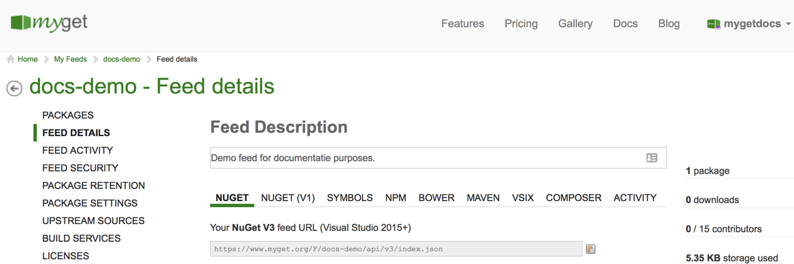
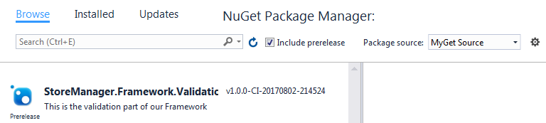

# NuGet \(.NET\)

TODO (inspiration: http://docs.myget.org/docs/walkthrough/getting-started-with-nuget)

## Connecting to a NuGet feed

Let's discuss where we can find our feed URL and how to connect to it using our favorite NuGet client.

<p class="alert alert-success">
    <strong>Tip:</strong> We support <a href="#visual-studio">Visual Studio</a>, <a href="#jetbrains-rider">JetBrains Rider</a>, the <a href="#nuget-cli">NuGet CLI</a>, <a href="#dotnet-cli">dotnet CLI</a>, <a href="#paket">Paket</a> and any other NuGet clients that use the standard NuGet v2 or v3 protocols.
</p>

### Determining the feed URL

#### Private feed

Private feeds are only accessible to the feed owner and to other users who were granted access by the feed owner. To connect to a feed we don't own, we may have to request permission from the feed owner.

<p class="alert alert-success">
    <strong>Tip:</strong> Read more about <a href="../inviting-users-to-a-feed.md">inviting users to a feed</a>.
</p>



#### Public feed

There are two types of public feeds we can connect to: public feeds we own ourselves, or a feed we want to consume from the gallery. The only real difference, in terms of consuming these feeds, is where to find the URL of the feed.

MyGet feeds have multiple endpoints, and each one is specific to a particular package type and protocol. Pick the NuGet endpoint URL that matches the protocol version you want to use (e.g. NuGet v3), and use that to configure the feed endpoint in your favorite NuGet client.

#### Gallery feed

First things first: we'll have to find the feed we want to connect to on the [MyGet Gallery](https://myget.org/gallery) (or on the MyGet Enterprise Gallery).


Once we found a feed of interest, we can get its connection details using the **Connect to feed** button. This will open a dialog where we can find the various endpoints for this feed.


We will need the NuGet V3 URL, so let's copy it for later use.

### Visual Studio

#### Private feed

We will need the URL for the feed we want to connect to. Learn more about [determining the feed URL](#determining-the-feed-url).

We can register a MyGet feed the same way we register any NuGet package source by using the Package Manager Settings dialog. We can find it under _Tools \| Library Package Manager \| Package Manager Settings_ in the Visual Studio menu.


When we try to consume this feed we will be prompted to enter our MyGet credentials. After entering our credentials the available packages will be shown.


<p class="alert alert-success">
    <strong>Tip:</strong> We can also use the <a href="../reference/credential-provider-visual-studio.md">MyGet Credential Provider for Visual Studio 2017</a>.
</p>

#### Public feed

We will need the URL for the feed we want to connect to. Learn more about [determining the feed URL](#determining-the-feed-url).

### JetBrains Rider

The first step in connecting Rider to a MyGet feed is adding it as a package source. We can do this using `NuGet.exe` (via good old [NuGet.config](https://docs.microsoft.com/en-us/nuget/schema/nuget-config-file#package-source-sections), or from within Rider. From the **NuGet tool window** (<kbd>Alt</kbd> + <kbd>7</kbd>), open the **Sources** tab. This will show us all of the NuGet configuration files that are in play, and a list of all feeds configured.


From here, we can add our MyGet feed (or edit an existing entry). We will have to provide our feed a name so we can easily recognize it in Rider, and the URL to our feed.

#### Private feed

Details on how to find the feed URL can be found in the [Find the feed URL](#determining-the-feed-url) section.

In order to consume our private feed we have to enter the feed URL and enter our credentials.


While Rider supports using pre-authenticated feeds as well as feeds that require entering credentials, we recommend using the latter. Rider safely stores our MyGet username/password in its [password store](https://www.jetbrains.com/help/idea/passwords.html).

When using the pre-authenticated feed we, of course, don't need to enter our credentials.

#### Public feed

We will need the URL for the feed we want to connect to. Learn more about [determining the feed URL](#determining-the-feed-url).

The feed types can be found in the **Feed Details** section under **Feed Type**.


After making sure our feed is a public one we can consume it in Rider. To work with public feeds, we can just leave the credentials empty and Rider will connect to the feed.


### NuGet CLI

NuGet package restore relies on the [NuGet.exe](https://nuget.org/nuget.exe) command line tool by using the [install](https://docs.microsoft.com/nuget/tools/nuget-exe-cli-reference#Install_Command) command. The command line will either prompt us for credentials or will look for credentials in the `NuGet.config` file in `%AppData%\NuGet\nuget.config` (if we use the `-NonInteractive` switch).

#### Private feed

We will need the URL for the feed we want to connect to. Learn more about [determining the feed URL](#determining-the-feed-url).

To register our credentials in the `NuGet.config` file we'll use the following commands:

<p class="alert alert-info">
    <strong>Note:</strong> These credentials are personal and should not be shared with others.
</p>

```shell
nuget setapikey [apikey] -source [feedUrl]
nuget sources add -name [name] -source [feedUrl] -user [username] -pass [pwd]
```

To update an already registered package source:

```shell
nuget setapikey [apikey] -source [feedUrl]
nuget sources update -name [name] -source [feedUrl] -user [username] -pass [pwd]
```

If we don't want to add our credentials to the global `NuGet.config` but to a specific one, we can use the `-configFile` parameter and specify the path to our prefered `NuGet.config` file:

```shell
nuget setapikey [apikey] -source [feedUrl] -configFile [configFilePath]
nuget sources add -name [name] -source [feedUrl] -user [username] -pass [pwd] -configFile [path]
```

If we want our credentials to be transferable for lets say, use by a build server we add the `-StorePasswordInClearText` flag:

```shell
nuget setapikey [apikey] -source [feedUrl] -configFile [configFilePath]
nuget sources update -name [name] -source [feedUrl] -user [username] -pass [pwd] -configFile [path] -StorePasswordInClearText
```

#### Public feed

We will need the URL for the feed we want to connect to. Learn more about [determining the feed URL](#determining-the-feed-url).

To add our feed to the global `NuGet.config` file we can use the command:

```shell
nuget sources add -name [name] -source [feedUrl]
```

If our build server needs to know about this feed, we can add it to a `NuGet.config` file in our project and push it to our code repository. To configure this feed in the specific `NuGet.config` file, we add the  `-configFile` parameter:

```shell
nuget sources add -name [name] -source [feedUrl] -configFile [path]
```

### dotnet CLI

In this section we are going to add our packages using the dotnet CLI. Make sure to [install the .NET Core tooling](https://www.microsoft.com/net/core). The folks (and docs) at Microsoft can help you on your way.

#### Private feed

We will need the URL for the feed we want to connect to. Learn more about [determining the feed URL](#determining-the-feed-url). Alternatively, we can use the pre-authenticated feed URL. Since pre-authenticated feed URLs contain your personal access token in the URL, we advise using the [NuGet command-line tool (CLI)](#nuget-cli) to configure your feeds instead. If you do want to make use of a pre-authenticated endpoint, we recommend creating a separate access token specifically for this purpose so that it can be revoked at any time. Access tokens can be managed from your MyGet profile.

#### Public feed


Let's copy this command and paste it on the command line. In our example, we'll use the Windows Comand Prompt. Do make sure the working directory is the root of the project we want to add the package(s) to (where the `.csproj` file lives).


After running this command, we'll see the following output, which tells us our package is installed:


In the project file, we can verify our package is installed. The `dotnet add` command will have added a `PackageReference` element.


### Paket

Just like NuGet, Paket is a package manager for .NET and Xamarin projects. It is designed to work with NuGet packages but also enables referencing files directly from GitHub repositories and GitHub Gists.

Let's see how you can use Paket with a MyGet feed.

#### Private feed

We will need the URL for the feed we want to connect to. Learn more about [determining the feed URL](#determining-the-feed-url).

To work with private feeds, you will have to provide Paket with credentials of some sort. In `paket.dependencies`, you can specify the credentials to be used for a feed.

Plain-text password:

```shell
source https://www.myget.org/F/paket-demo/api/v2 username: "username_here" password: "password_here"
```

This does, however, require checking in credentials into source control. Alternatively, you can make use of environment variables:

```shell
source https://www.myget.org/F/paket-demo/api/v2 username: "%MY_USERNAME%" password: "%MY_PASSWORD%"
```

Using this technique is interesting as it makes it possible to securely provide credentials in an environment variable on build servers like [TeamCity](https://www.jetbrains.com/) with its [build parameters](https://confluence.jetbrains.com/display/TCD8/Defining+and+Using+Build+Parameters+in+Build+Configuration) or MyGet's own [build services and support for environment variables](https://docs.myget.org/docs/reference/build-services#User-defined_environment_variables).

<p class="alert alert-info">
    <strong>Note:</strong> It is also possible to make use of a <a href="../reference/feed-endpoints.md#private-feed-endpoints-and-authentication">pre-authenticated feed URL</a>. Do keep in mind that such URLs contain a MyGet API key and should be treated as confidential.

  The Paket source will look like the following in such case: `https://www.myget.org/F/paket-demo/auth/147e9e61-95db-4747-9e5a-09debb256c99/`
</p>

#### Public feed

We will need the URL for the feed we want to connect to. Learn more about [determining the feed URL](#determining-the-feed-url).

## Creating NuGet/.NET Core packages

TODO could have links to the NuGet documentation

## Publishing to MyGet

TODO

## Troubleshooting

### Package not found during package restore

When working with our own feed, whether private or public, chances are we want to consume more than just that feed. When using our MyGet feed and the NuGet.org feed simultaneously, an interesting error may occur during package restore.

> Unable to find version xxxx of package yyyy

The reason this happens is because the NuGet command line, the NuGet Visual Studio Extension and the NuGet Powershell Console all have a configuration option specifying which package source to install from. When this setting is changed to one specific feed, other feeds will be ignored and the error above will be shown during package restore.

The solution is very simple: we can set the active package source to "aggregate" in Visual Studio, or simply configure NuGet to always use the "aggregate source" for the current project. NuGet has an inheritance system for NuGet.config files, where the NuGet.config file closest to the solution file gets the last say. If we add the following NuGet.config file next to the solution file for our project, we should be fine:

```xml
  <?xml version="1.0" encoding="utf-8"?>
    <configuration>
      <activePackageSource>
         <add key="All" value="(Aggregate source)" />
      </activePackageSource>
    </configuration>
```

We can take this one step further and instead of configuring our MyGet feed globally for our system (and requiring other devs on our team to do the same), why not distribute a `NuGet.config` along with the sources? We can place a `NuGet.config` file right next to our `.sln` file for NuGet to pick it up.

```xml
  <?xml version="1.0" encoding="utf-8"?>
  <configuration>
    <packageRestore>
      <add key="enabled" value="True" /><add key="automatic" value="True" />
    </packageRestore>
    <packageSources>
      <add key="nuget.org" value="https://www.nuget.org/api/v2/" />
      <add key="MyGet" value="https://www.myget.org/F/chucknorris/" />
    </packageSources>
    <disabledPackageSources />
    <activePackageSource>
      <add key="All" value="(Aggregate source)" />
    </activePackageSource>
  </configuration>
```

This really makes working with multiple feeds a breeze. But we can go even further and use only MyGet, proxying packages from NuGet.org along the way. For more info on how that works, check the [documentation on upstream package sources](/docs/reference/package-sources#Scenario_-_Proxying_upstream_feeds_and_packages).
