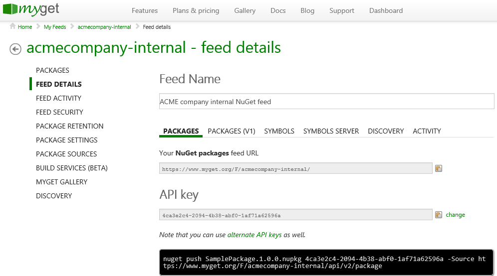
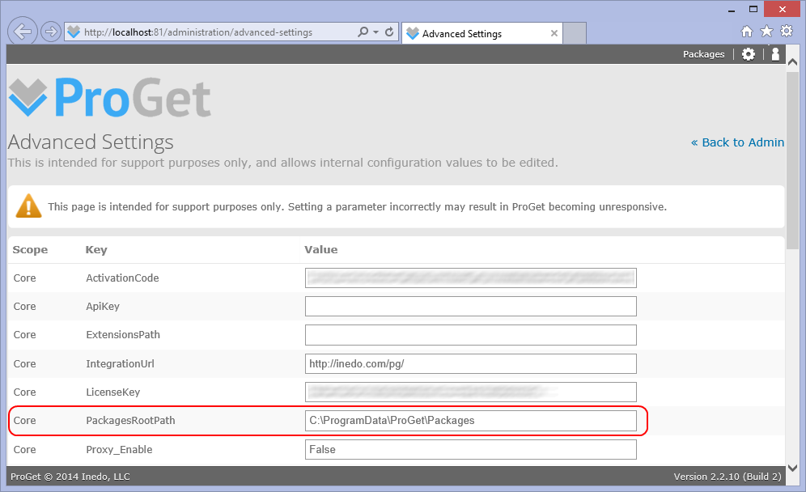

# Migrating to MyGet (or creating a feed from uploaded packages)

If you have a large number of packages that you want to migrate to MyGet, this document will guide you through that process. Whether you are migrating from a file share or a *NuGet.Server* based feed or simply want to do a bulk upload to MyGet, the following tips will help.

We will be using a bulk upload approach. Note that [importing packages from an existing feed](/docs/reference/package-sources#Scenario_-_Add_package_from_feed) is possible too, if the feed is available over the Internet. A bulk upload is typically the easiest way to migrate packages to a MyGet feed so we will focus on that one.

## Bulk-uploading packages to MyGet

Before being able to bulk-upload packages to MyGet, you will need the following:

* A folder in which the packages that should be uploaded is stored
* The feed details, such as the API key, from the feed created on MyGet

	

Once you have these, open a command prompt and make sure *nuget.exe* is in the path. Next, run the following command:

	nuget push * <apikey> -Source <feed>

An example of this, based on the screenshot earlier, would be:

	nuget push * 4ca3e2c4-2094-4b38-abf0-1af71a62596a -Source https://www.myget.org/F/acmecompany-internal/

This command will trigger the upload of all packages in the working directory to the MyGet feed.

## Where are my packages stored?

This topic will guide you through where packages can be found in popular NuGet feeds. Keep in mind these packages can be uploaded in bulk using the technique described earlier.

### File share or directory

When bulk uploading from a file share, you probably already know the path. Use the command described earlier to perform a bulk upload of packages.

### NuGet.Server

Packages from *NuGet.Server* are stored under the *packages* folder of the application (unless configured otherwise). Use the command described earlier to perform a bulk upload of packages.

### NuGet Gallery

The [NuGet gallery](https://github.com/NuGet/NuGetGallery) stores its packages on the file system, under the *~/App_Data/Files* folder (unless configured otherwise). Use the command described earlier to perform a bulk upload of packages.

### ProGet

By default, ProGet stores its packages in the *C:\ProgramData\ProGet\Packages* folder. The real path to where packages are stored can be found from the administration dashboard under **Advanced Settings**. The *PackagesRootPath* setting will provide the full path.

ProGet stores packages per feed. If you want to upload one specific feed, open a command prompt in the feed directory and make use of the command above to upload packages to MyGet. If you wish to upload all packages at once, use the following PowerShell command:

	Get-ChildItem -Path "<ProGet packages folder>" -Filter *.nupkg -Recurse | %{ nuget push $_.FullName <apikey> -Source <feed> }

Here's a full example:

	Get-ChildItem -Path "C:\ProgramData\ProGet\Package" -Filter *.nupkg -Recurse | %{ nuget push $_.FullName 4ca3e2c4-2094-4b38-abf0-1af71a62596a -Source https://www.myget.org/F/acmecompany-internal/ }

### TeamCity

TeamCity treats packages as artifacts. Packages will be stored in under the *<TeamCity data directory>/system/artifacts* directory, in a separate directory per project, build configuration and build number.

Using PowerShell, bulk uploading artifacts is easy. The following command can be used:

	Get-ChildItem -Path "<TeamCity data directory>/system/artifacts" -Filter *.nupkg -Recurse | %{ nuget push $_.FullName <apikey> -Source <feed> }

Here's an example:

	Get-ChildItem -Path "C:\ProgramData\JetBrains\TeamCity\system\artifacts" -Filter *.nupkg -Recurse | %{ nuget push $_.FullName 4ca3e2c4-2094-4b38-abf0-1af71a62596a -Source https://www.myget.org/F/acmecompany-internal/ }
