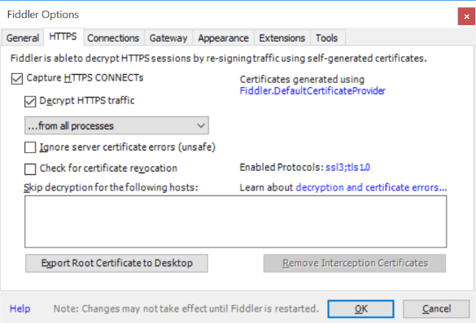

# Capturing traffic with Fiddler

At MyGet support, we sometimes have to capture HTTP(S) traffic in order to be able to diagnose the issue at hand. If this is the case, we'll send you to the page you are currently viewing.

## Setting up Fiddler for capturing requests

To capture traffic with Fiddler, make sure to install the latest version of [Fiddler](http://www.telerik.com/download/fiddler). Once installed, launch the application and proceed with the following:

* Disable capturing traffic using the *File | Capture Traffic* menu.
* Remove all sessions (select all items in the list, press the *Delete* key)
* Configure Fiddler to capture HTTPS traffic from the *Tools | Fiddler Options...* menu. Open the *HTTPS* tab and check *Decrypt HTTPS traffic*
* Save the settings

## Capturing a Fiddler trace

Make sure to verify Fiddler is set up correctly using the above steps. Next, make sure Fiddler is configured to capture traffic by using the *File | Capture Traffic* menu.

Once the requested actions have been performed, use the *File | Save | All Sessions* menu and store the captured sessions. MyGet support will ask to send over the saved archive.

### Tips for capturing NuGet and VSIX traffic

*Make sure to start Fiddler prior to NuGet or Visual Studio.*

If no traffic from Visual Studio is shown in Fiddler, try setting one of the following:

* Set the `HTTP_PROXY` environment variable to `http://127.0.0.1:8888`
* or use the NuGet configuration commands to set the proxy:

	`NuGet.exe config -Set HTTP_PROXY=http://127.0.0.1:8888`

### Tips for capturing npm traffic

Make sure to configure the npm proxy and use Fiddler:

	npm config set proxy http://127.0.0.1:8888
	npm config set https-proxy https://127.0.0.1:8888

After capturing traffic, the proxy settings can be removed.

	npm config delete proxy
	npm config delete https-proxy
