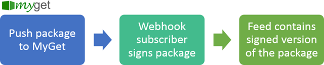
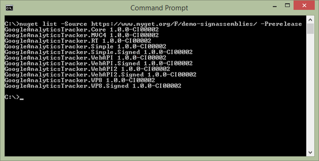

# Samples

Theory is nice, but it's always good to see some practical samples of implementing a web hook receiver for MyGet.

<p class="alert alert-success">
<strong>Tip:</strong> For .NET developers, the <a href="https://github.com/aspnet/WebHooks">Microsoft ASP.NET WebHooks</a> library makes it easy to implement MyGet web hooks. It comes with an event handler and strong-typed events that allow building integrations with MyGet in an easy manner.
</p>

## Implementing custom package retention using webhooks

MyGet offers [retention policies](todo) that run whenever a package is added to a feed. These retention policies offer some options on when a package can be automatically removed from a feed, but it may be useful to implement a custom retention policy that is triggered [when a package is added](webhooks.md#package-added).

<p class="alert alert-info">
<strong>Note:</strong> Core for this example is <a href="https://github.com/MyGet/webhooks-custom-retention">available on GitHub</a>.
</p>

We'll first need something that can run our custom logic whenever a webhook event is raised. This can be an ASP.NET MVC, Web API, NancyFx or even a PHP application. In this case, let’s go with an ASP.NET Web API controller. We want to be triggered on POST when a package added event is raised.



```csharp
// POST /api/retention
public async Task<HttpResponseMessage> Post([FromBody]WebHookEvent payload)
{
    // The logic in this method will do the following:
    // 1) Find all packages with the same identifier as the package that was added to the originating feed
    // 2) Enforce the following policy: only the 5 latest (stable) packages matching the same minor version may remain on the feed. Others should be removed.
    string feedUrl = payload.Payload.FeedUrl;

    // Note: the following modifies NuGet's client so that we authenticate every request using the API key.
    // If credentials (e.g. username/password) are preferred, set the NuGet.HttpClient.DefaultCredentialProvider instead.
    PackageRepositoryFactory.Default.HttpClientFactory = uri =>
    {
        var client = new NuGet.HttpClient(uri);
        client.SendingRequest += (sender, args) =>
        {
            args.Request.Headers.Add("X-NuGet-ApiKey", ConfigurationManager.AppSettings["Retention:NuGetFeedApiKey"]);
        };
        return client;
    };

    // Prepare HttpClient (non-NuGet)
    var httpClient = new HttpClient();
    httpClient.DefaultRequestHeaders.Add("X-NuGet-ApiKey", ConfigurationManager.AppSettings["Retention:NuGetFeedApiKey"]);

    // Fetch packages and group them (note:  only doing this for stable packages, ignoring prerelease)
    var packageRepository = PackageRepositoryFactory.Default.CreateRepository(feedUrl);
    var packages = packageRepository.GetPackages().Where(p => p.Id == payload.Payload.PackageIdentifier).ToList();
    foreach (var packageGroup in packages.Where(p => p.IsReleaseVersion())
        .GroupBy(p => p.Version.Version.Major + "." + p.Version.Version.Minor))
    {
        foreach (var package in packageGroup.OrderByDescending(p => p.Version).Skip(5))
        {
            await httpClient.DeleteAsync(string.Format("{0}api/v2/package/{1}/{2}?hardDelete=true", feedUrl, package.Id, package.Version));
        }
    }

    return new HttpResponseMessage(HttpStatusCode.OK) { ReasonPhrase = "Custom retention policy applied." };
}
```


Once we have this in place and are hosting it somewhere, we can configure the webhook on our MyGet feed.

On our MyGet feed, we can create a new webhook. It should send application/json for the package added event to the URL where we deployed the above code.


When this hook now triggers, we will be retaining just the 5 latest minor versions of a package (ignoring prereleases).

## Automatically strong name signing NuGet packages

Some developers prefer to strong name sign their .NET assemblies. Signing them also means that the dependencies that are consumed must be signed. Not all third-party dependencies are signed, though, for example when consuming packages from NuGet. Some are signed, some are unsigned, and the only way to know is by seeing compiler errors. Using web hooks, we can create a signed version of our NuGet packages whenever we push an unsigned version to MyGet.

<p class="alert alert-info">
<strong>Note:</strong> Core for this example is <a href="https://github.com/MyGet/webhooks-sign-package">available on GitHub</a>.
</p>

The [Assembly Strong Naming Toolkit](https://www.nuget.org/packages/Nivot.StrongNaming/) can be installed into our project, after which we can use the NuGet Package Manager Console to sign referenced assemblies. There is also the [.NET Assembly Strong-Name Signer](http://brutaldev.com/post/2013/10/18/NET-Assembly-Strong-Name-Signer) by Werner van Deventer, which provides us with a nice UI as well.

The problem is that the above tools only sign the assemblies once we already consumed the NuGet package. With package restore enabled, that’s pretty annoying as the assemblies will be restored when we don’t have them on our system, thus restoring unsigned assemblies...

We created [a small utility](https://github.com/maartenba/nuget-signature) that can sign all assemblies in a NuGet package and creates a new package out of those. This signed package can then be used instead of the original, making sure we can simply consume the package in Visual Studio and be done with it.

What if we link this to a MyGet web hook? Whenever we push a package, we can sign it and publish a signed version right next to the original.





```csharp
// POST /api/sign
public async Task<HttpResponseMessage> Post([FromBody]WebHookEvent payload)
{
    if (payload.Payload.PackageIdentifier.EndsWith(ConfigurationManager.AppSettings["Signature:PackageIdSuffix"]))
    {
        return new HttpResponseMessage(HttpStatusCode.OK) {ReasonPhrase = "Package is already signed. "};
    }

    string tempPath = Path.GetTempFileName();
    try
    {
        // Download the package
        var httpClient = new HttpClient();
        var packageStream = await httpClient.GetStreamAsync(payload.Payload.PackageDownloadUrl);

        using (var stream = new FileStream(tempPath, FileMode.OpenOrCreate, FileAccess.Write))
        {
            packageStream.CopyTo(stream);
        }

        // Sign the package
        PackageSigner signer = new PackageSigner();
        if (signer.SignPackage(tempPath, tempPath,
            ConfigurationManager.AppSettings["Signature:KeyFile"],
            ConfigurationManager.AppSettings["Signature:KeyFilePassword"],
            payload.Payload.PackageIdentifier + ConfigurationManager.AppSettings["Signature:PackageIdSuffix"]))
        {
           var server = new PackageServer(ConfigurationManager.AppSettings["Signature:NuGetFeedUrl"], "Signature/1.0");
           server.PushPackage(ConfigurationManager.AppSettings["Signature:NuGetFeedApiKey"], new OptimizedZipPackage(tempPath), new FileInfo(tempPath).Length, 60 * 1000, true);
           OptimizedZipPackage.PurgeCache();

           return new HttpResponseMessage(HttpStatusCode.Created) { ReasonPhrase = "Package has been signed." };
        }
    }
    finally
    {
        File.Delete(tempPath);
    }

    return new HttpResponseMessage(HttpStatusCode.OK) { ReasonPhrase = "Package is already signed." };
}
```


Once we deploy this and configure a MyGet HTTP POST web hook on our feed, all packages that are pushed will be signed automatically, and also pushed to our feed.

